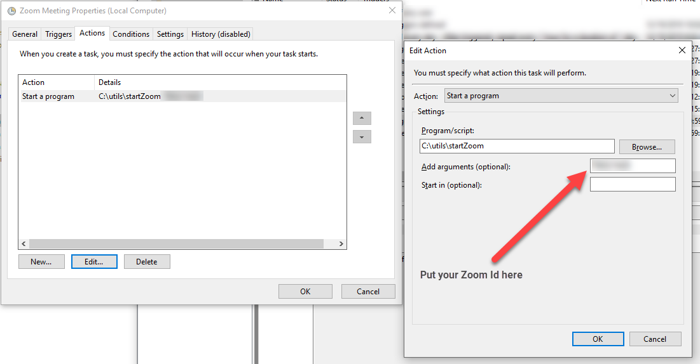
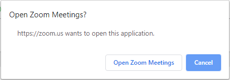

# startZoom
A very simple command line program (CLI) to join a [Zoom](http://zoom.us) (https://zoom.us) conference.

If you have to join a daily or weekly conference call/stand-up meeting, this program can be used with Windows Task Scheduler to have your computer automatically join the meeting.  No more remembering about regular meetings or being late, etc. 

# Usage

Download the latest binary from the [release](../../releases) page. Unzip it to your hard drive and run it:
```
startZoom.exe
```

You'll see the command-line arguments, which is just the meeting number and an optional parameter for how long to sleep after opening the URL in Chrome:
```
C:\projects\startZoom> startZoom.exe
Usage: startZoom (--sleep <ms>) <Meeting number>
    --sleep <ms>     - The number of ms to sleep for between opening the URL and sending the keys to get past the "Open Zoom Meetings?" popup.  Default: 5000 ms (5 seconds)
    <Meeting number> - The zoom meeting number
ex. startZoom 1234567890
```

The meeting number can be gotten from the zoom website or from a URL sent for you to join a meeting.  For example, if you were asked to join https://zoom.us/j/1234554321 then the meeting number is the last part the URL: `1234554321`.

So, to join Zoom meeting 1234554321, you'd run:
```
startZoom 1234554321
```

# How to automate it
See [here](https://www.windowscentral.com/how-create-automated-task-using-task-scheduler-windows-10) for a tutorial on how to use Windows Task Scheduler. It's pretty intuitive, if you've used cron or anything similar.

Here's a screenshot to show you what to put in the "Action" fields. 



# How does it work?

It pushes the URL of the Zoom meeting to your default browser, which I'm assuming is Chrome.  Then the program waits for 5 seconds for Chrome to load up the Zoom webpage and prompt you with:


Then it enters the tab key, and the space key to select the "Open Zoom Meetings" button.

You can see the very, very simple source code [here](./startZoom.au3).

# Related projects

* This Zoom launcher which is quite a bit more complicated and requires calendar integration: https://github.com/benbalter/zoom-launcher
